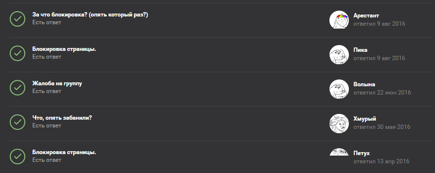
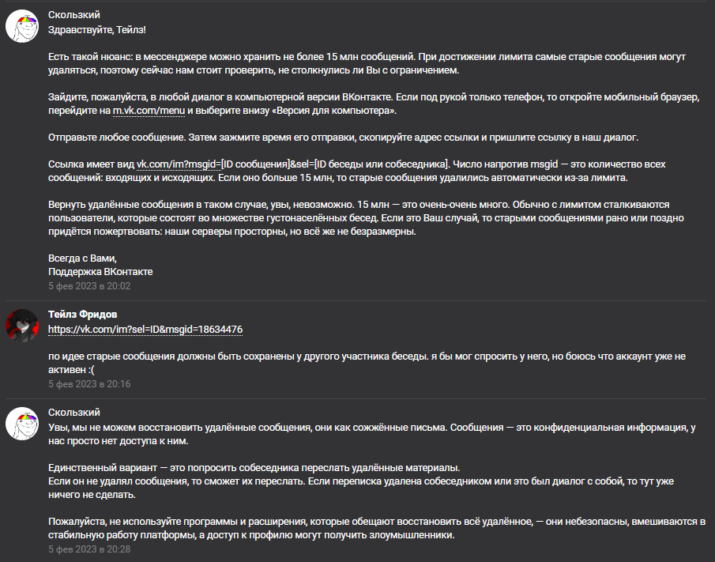
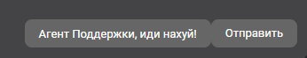
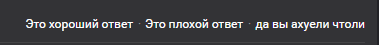

# BetterVKSupport
Улучшаем ваш опыт общения с технической поддержкой ВКонтакте без проблем и мозолей!

## Установка
1. Скачиваете актуальную версию расширения.
2. Распаковываете скачанный файл в любую директорию.
3. Открывайте Google Chrome
4. Перейдите в `chrome://extensions/` и включите `Режим разработчика`
5. Нажмите на кнопку `Загрузить распакованное расширение` и выберите папку `src`.
6. Включите расширение.

#### Готово! Теперь ваше общение с технической поддержкой ВКонтакте будет приносить вам только удовольствие!

## Примеры
* Теперь вам будут отвечать только настоящие агенты поддержки, которые понимают толк в общении! 

* Пример диалога. 

* Уникальная функция, которая позволяет проставить дизлайки на все ответы технической поддержки, если они кажутся вам максимально ебланскими. 

* Уникальная функция, которая позволяет коротко и понятно объяснить агенту поддержки то, что он не прав. 

## Остались вопросы?
Пишите в [issues!](https://github.com/tailsjs/BetterVKSupport/issues)